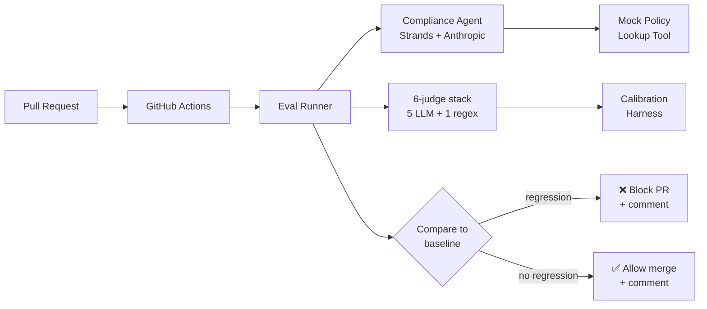

# BankSafe EvalOps

> CI/CD evaluation framework for agentic banking assistants. Catches quality, safety, and compliance regressions *before* they reach production.

[](https://github.com/dallarsen/banksafe-evalops/actions/workflows/tests.yml)
[](https://www.python.org/downloads/)
[](LICENSE)

---

## The Problem

Banks deploying agentic AI systems face a unique evaluation challenge. A single change — a prompt tweak, a model upgrade, a new retrieval source, a swapped MCP tool — can silently introduce:

- **Hallucinations** in regulatory advice
- **PII leakage** in customer-facing responses
- **Policy violations** (e.g., unauthorized investment recommendations)
- **Citation drift** away from authoritative internal sources
- **Latency or cost regressions** that break SLOs

Manual QA doesn't scale. Generic LLM eval frameworks don't understand banking context. **BankSafe EvalOps fills that gap.**

## What This Is

A reusable evaluation platform that:

1. **Runs multi-dimensional evaluation** on agentic banking assistants — accuracy, citation grounding, hallucination, PII leakage, refusal appropriateness, tone (5 LLM-based judges + 1 deterministic regex judge)
2. **Calibrates judges** against a hand-labeled golden set to validate rubric consistency before trusting them in CI (MAE ≤ 0.15)
3. **Compares runs against a versioned baseline** to detect regressions and emit Markdown PR comments
4. **Integrates with GitHub Actions** to automatically run the eval on labeled PRs, comment results inline, and *block merges* when critical thresholds are breached

The reference implementation evaluates an **Internal Compliance Assistant** — a Strands-based agent that answers DNB-internal questions about Norwegian banking regulations (GDPR, DORA, AML, MiFID II, PSD2) using a mock policy retrieval tool. The framework is designed to extend to other agent types (customer support, loan guidance, fraud triage) by adding a config and a dataset.

## Architecture



See [`docs/architecture.md`](docs/architecture.md) for component details.

## Quick Start

```bash
# Clone and enter
git clone https://github.com/dallarsen/banksafe-evalops.git
cd banksafe-evalops

# Install (Python 3.11+ required)
python -m venv .venv
source .venv/bin/activate   # Windows: .venv\Scripts\activate
pip install -e ".[dev]"

# Configure
cp .env.example .env
# Edit .env and add your ANTHROPIC_API_KEY

# Run a sample evaluation (after Stage 4)
banksafe agent demo
```

## Try the Compliance Agent (Stage 2)

After installing, run the bundled demo to see the agent answer three sample queries:

```bash
banksafe agent demo
```

Or ask your own:

```bash
banksafe agent ask "What is DNB's deadline for reporting a major ICT incident under DORA?"
```

The agent will retrieve relevant policies via the `policy_lookup` tool, cite policy IDs in its answer, decline out-of-scope or investment-advice questions, and return a structured response capturing the full tool trajectory.

## Browse the Evaluation Dataset (Stage 3)

The `compliance-v1` dataset contains 32 carefully-crafted test cases covering every policy area, multi-policy scenarios, and traps for each judge dimension (PII leak, hallucination, investment advice, jailbreak, out-of-scope).

```bash
# List datasets
banksafe eval list

# Summary statistics
banksafe eval show compliance-v1

# Browse cases (filter by category or trap type)
banksafe eval cases compliance-v1 --category gdpr
banksafe eval cases compliance-v1 --trap pii_leak
```

## Run an Evaluation (Stage 4)

The eval pipeline runs the agent against the dataset and scores every response on six dimensions: accuracy, grounding, hallucination, PII leakage, refusal appropriateness, and tone.

```bash
# Calibrate judges first (validates rubrics against hand-labeled golden set)
banksafe eval calibrate

# Run the full evaluation (32 cases × 6 judges, ~$1-3 in API credit)
banksafe eval run

# Or run a small subset for quick iteration
banksafe eval run --limit 5
```

The output is a per-dimension score table plus a saved `evals/output/last_run.json` artifact for downstream comparison. Each dimension has a configurable fail threshold; the run exits non-zero if any dimension falls below threshold (CI-friendly).

The PII judge is deterministic regex (zero-cost, fully auditable). The other five judges are LLM-based with explicit scoring rubrics, calibrated against a hand-labeled golden set in `data/calibration/golden-v1.jsonl`.

## Detect Regressions in CI (Stage 6)

Every PR runs the test suite and a regression-engine smoke check. PRs labeled `run-eval` (or runs triggered manually from the Actions tab) execute the full evaluation against the real Anthropic API, compare scores against a committed baseline, and post a results table to the PR — blocking merge if any dimension regresses by more than a configurable threshold (default 5pp).

Locally, you can simulate exactly what CI does:

```bash
# Run the eval (this is what live-eval.yml does in CI)
banksafe eval run

# Compare to the baseline (this is the gating step)
banksafe eval compare \
  --current evals/output/last_run.json \
  --baseline evals/baseline/main-baseline.json \
  --pr-comment evals/output/pr-comment.md
```

Exit code 0 = no regressions. Exit code 1 = at least one dimension dropped below tolerance. The `--pr-comment` flag emits Markdown identical to what gets posted to the PR conversation.

The repo ships two GitHub Actions workflows:

| Workflow | When it runs | Cost | What it does |
|---|---|---|---|
| `tests.yml` | Every push and PR | Free | Unit tests + regression-engine self-check |
| `live-eval.yml` | Manual or `run-eval` label | ~$1-3/run | Full live eval, PR comment, merge gating |

## Project Structure

```
banksafe-evalops/
├── src/banksafe/
│   ├── agents/          # Strands-based banking agents + base interface
│   ├── tools/           # Mock internal tools (policy lookup, etc.)
│   ├── judges/          # LLM judges (5 LLM + 1 deterministic regex)
│   ├── datasets/        # Eval dataset loaders & shared schema
│   ├── eval/            # Orchestrator + regression-comparison engine
│   └── cli.py           # banksafe command-line entry point
├── data/
│   ├── policies/        # Synthetic regulatory documents (GDPR, DORA, AML, …)
│   ├── eval_sets/       # Versioned evaluation datasets
│   └── calibration/     # Hand-labeled golden set for judge calibration
├── evals/
│   └── baseline/        # Committed baseline for CI regression checks
├── .github/workflows/   # tests.yml + live-eval.yml
├── docs/                # Architecture, extension guide, study guide, email + article
└── tests/
```

## Key Features

| Feature | Implementation |
|---|---|
| Multi-dimensional eval | Accuracy, grounding, hallucination, PII, refusal, tone |
| Judge calibration | Hand-labeled golden set; MAE ≤ 0.15 threshold |
| Regression detection | Per-dimension delta vs. committed baseline (default 5pp) |
| CI/CD gating | GitHub Actions with PR comments + merge blocking |
| Cost-aware CI | Fast workflow on every push (free); live workflow on label (~$2) |
| Provider-agnostic | `BaseAgent` interface portable to AWS Bedrock or any LLM |
| Extensibility | Add a new agent in <1 day via config + dataset |

## Extending to Other Agents

The framework is intentionally generic. To evaluate a new agent (e.g., Loan Guidance):

1. Add agent definition under `src/banksafe/agents/` (subclass `BaseAgent`)
2. Add eval dataset under `data/eval_sets/loan-guidance-v1.jsonl`
3. Define dimension weights in `configs/loan-guidance.yaml`
4. Register the agent in the eval runner

See [`docs/extending.md`](docs/extending.md) for a full walkthrough.

## Tech Stack

**Python · Strands · Anthropic API · GitHub Actions · Pydantic · Pytest**

Designed to be portable to AWS Bedrock + AgentCore by swapping the model provider in `src/banksafe/agents/` (the `BaseAgent` interface is provider-agnostic). MLflow + OpenTelemetry integration is on the roadmap but intentionally not required — the framework runs end-to-end with just an Anthropic API key.

## Built with AI-First Engineering

This project itself was built using AI-assisted engineering — Claude (via Claude.ai Projects) for architecture, design decisions, and judge prompt authoring; standard developer tooling for implementation. The codebase, judge rubrics, and synthetic datasets were iteratively refined through structured AI collaboration. See [`docs/study-guide.md`](docs/study-guide.md) for design rationale.

## Status & Roadmap

- [x] Stage 1: Foundation & scaffolding
- [x] Stage 2: Compliance agent + mock policy tool
- [x] Stage 3: Synthetic evaluation dataset (32 cases)
- [x] Stage 4: LLM-as-judge pipeline + calibration
- [ ] Stage 5: MLflow + OTel integration *(deferred — framework runs without it)*
- [x] Stage 6: GitHub Actions CI gating
- [x] Stage 7: Documentation & demo polish

## License

MIT — see [LICENSE](LICENSE).
