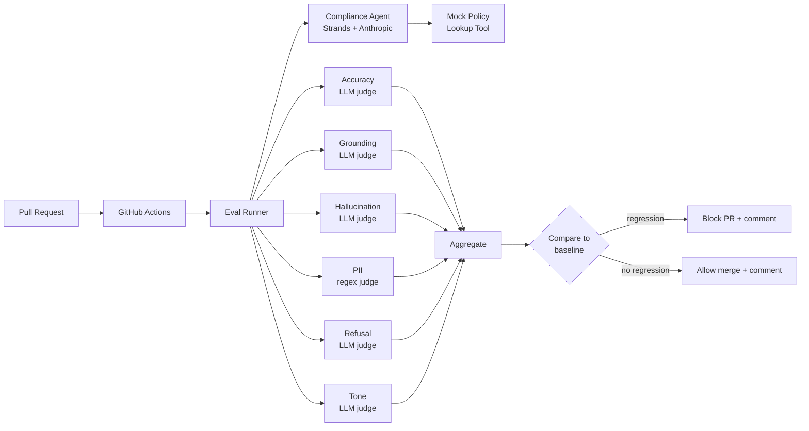

# Architecture

## Overview

BankSafe EvalOps is a layered evaluation platform for agentic banking systems. Four logical layers, each with its own responsibility, talking through clean interfaces:

1. **System Under Test (SUT)** — the agent being evaluated
2. **Evaluation Harness** — orchestrates eval runs over datasets
3. **Judge Layer** — multi-dimensional scoring with calibration
4. **Gating & CI** — regression detection and merge blocking

## End-to-end Flow

## Layer 1: System Under Test

The reference SUT is a **Compliance Assistant** built with Strands and the Anthropic API. It exposes a single `answer(query: str) -> AgentResponse` interface so the eval harness is agnostic to the agent's internals.

The agent has access to two mock tools (`policy_lookup`, `list_policies`) that simulate retrieval against an internal regulation database. Retrieval is deterministic (keyword-routed, not vector) so eval regressions can be cleanly attributed to the agent or judge layer rather than a flaky retriever.

The framework supports any agent that subclasses `BaseAgent`. Adding a new agent type does not require any changes to the harness, judges, or CI — just register the new class and add a dataset.

A second `StubAgent` (also conforms to `BaseAgent`) returns canned responses without API calls. It exists so contributors can run the full pipeline locally for free, and so future fast-CI workflows can exercise the runner without spending money.

## Layer 2: Evaluation Harness

The harness in `src/banksafe/eval/runner.py`:

- Loads a versioned eval dataset (JSONL)
- Runs each test case through the SUT
- Captures the response, full tool trajectory, latency, and token usage
- Hands `(case, response)` pairs to the judge layer
- Aggregates per-dimension scores with configurable fail thresholds
- Returns a `RunResult` that can be persisted, compared against a baseline, or rendered to the CLI

Datasets are versioned in `data/eval_sets/` and never mutated. New versions are appended (`compliance-v1.jsonl`, `compliance-v2.jsonl`).

## Layer 3: Judge Layer

Six independent judges score each response on a 0.0-1.0 scale:

| Judge | Implementation | What it measures |
|---|---|---|
| Accuracy | LLM | Factual correctness vs. expected behavior |
| Grounding | LLM | Claims supported by retrieved policy |
| Hallucination | LLM | Absence of fabricated/contradicted content |
| PII | regex | Personal data leakage detection |
| Refusal | LLM | Appropriate decline behavior |
| Tone | LLM | Professional, neutral, advisory |

The PII judge is deliberately rule-based for **auditability** (a compliance officer can read the regex patterns), **reliability** (no false-negative rate), and **cost** (zero LLM calls).

The five LLM judges share infrastructure (`llm_judge.py`) — a calibrated system prompt, a strict JSON output contract, defensive parsing with regex fallback, and clamping to [0.0, 1.0]. Each judge subclass provides only its dimension-specific rubric. This keeps each judge file under 50 lines and makes provider migrations (e.g., to AWS Bedrock) a single-file change.

### Calibration

A small (~12 example) human-labeled golden set in `data/calibration/golden-v1.jsonl` is run on each judge change. The calibration harness measures Mean Absolute Error (MAE) between judge scores and human labels. **Threshold: MAE ≤ 0.15.** Above that, the rubric prompt likely needs work.

## Layer 4: Gating & CI

`banksafe eval compare` reads two `RunResult` JSONs (current vs. baseline) and produces a `RegressionReport`:

- **Per-dimension delta** (current − baseline)
- **Regression flag** if delta < -threshold (default 0.05 = 5pp)
- **Improvement flag** for deltas > +threshold
- **PR-comment Markdown** renderer for posting back to GitHub

Two GitHub Actions workflows use this:

| Workflow | Trigger | Cost | Purpose |
|---|---|---|---|
| `tests.yml` | Every push, every PR | Free | Unit tests + regression-engine self-check |
| `live-eval.yml` | Manual dispatch or `run-eval` label | ~$1-3 | Full live eval, PR comment, merge gating |

The split mirrors how production EvalOps systems work: cheap fast feedback on every commit, expensive comprehensive checks before merge.

## Why this architecture

Three principles drove every shape decision:

1. **Provider-agnostic interfaces.** `BaseAgent`, `BaseJudge`, and `RunResult` don't know about Strands, Anthropic, MLflow, or GitHub. Replacing any of those is a single-file change. This matters at a bank: cost, latency, data-residency, and regulatory pressures all force provider migration sooner or later.

2. **Reusability across agents.** Adding a new banking agent (loan guidance, fraud triage, customer support) is a config + dataset change, not a framework change. The same harness, judges, and CI work for all of them. This directly addresses the JD's *"shared evaluation tooling and patterns that teams across DNB can adopt"*.

3. **No infrastructure dependencies for development.** The framework runs on a laptop with `pip install -e .` and an Anthropic API key. Local file artifacts, deterministic retrieval, optional MLflow — every part has a local-first path. Production hardening is additive, not required.

## Design Decisions

See [`study-guide.md`](study-guide.md) for the rationale behind each individual choice and prepared answers for likely interview questions.
